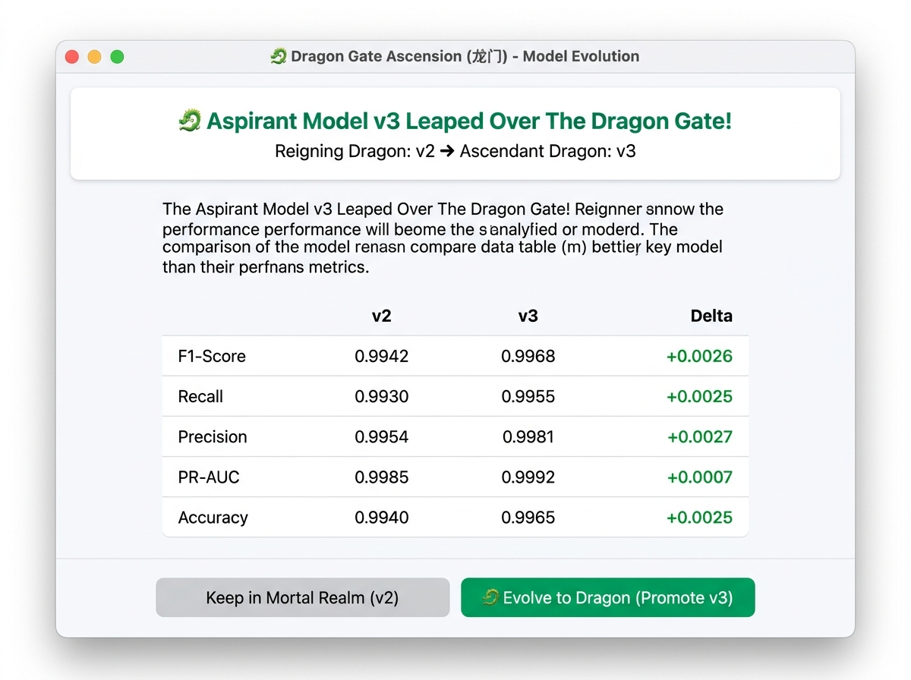

# BODMAS // CONTINUAL MALWARE DEFENSE PIPELINE
[](https://www.python.org/)
[](https://onnxruntime.ai/)
[]()
[]()
[]()
[]()

An enterprise-grade, real-time PE malware detection and continual learning pipeline. Monitors filesystem downloads, extracts 2,381 static PE features, performs sub-millisecond neural network inference via an optimized **C++ ONNX Runtime engine** (with PyTorch fallback), captures low-confidence telemetry into categorized feedback pools, verifies ground truth through a **Keyless Two-Step Verification Engine** (Authenticode + native Windows Defender), retrains aspirant candidates via **Experience Replay**, subjects them to the **Dragon Gate (龙门)** trial protocol, and deploys zero-downtime atomic pointer swaps.

```text
[ SYSTEM TELEMETRY & SPECS ]
├─ Core Engine   : C++ ONNX Runtime (v1.16+) / PyTorch Fallback
├─ Feature Plane : 2,381-D Raw -> 2,332 Non-Const -> Top-250 Selected (LIEF + pefile)
├─ Latency       : ~0.74 ms / binary (Inference: 0.12ms | Probe: 0.04ms)
├─ Classification: Binary Threshold @ 0.55 [Benign: 0 | Malicious: 1]
├─ Verification  : Keyless Two-Step (Step 1: Authenticode PKCS#7 | Step 2: Windows Defender CLI)
├─ Safety Layer  : Atomic pointer swaps (`ACTIVE_MODEL.json`) + Experience Replay Memory
└─ Gatekeeper    : 4-Trial Dragon Gate (龙门) Zero-Regression Protocol
```

---

## ⚡ Architecture Flow

```text
[ Inbound Download ] ──> [ pe_download_watchdog.py ] (MZ Magic Probe < 0.05ms)
                               │ (Valid PE)
                               ▼
                        [ extraction/pe_extractor.py ] (2,381-D -> Top-250)
                               │
                               ▼
                        [ inference/predictor.py ] (ONNX Engine < 0.8ms)
                               │
                ┌──────────────┴──────────────┐
                ▼                             ▼
     [ High Confidence Alert ]       [ Telemetry Ingestion ]
     (Allow / Block Alert)                    │
                                              ▼
                                     [ data/feedback/pending/ ]
                                     ├── [ benign/ ]  (Pred: Benign)
                                     └── [ malware/ ] (Pred: Malware)
                                              │
                                              ▼ (training/batch_verify.py --two-step)
                                     [ 🛡️ TWO-STEP VERIFICATION ]
                                     ├─ Step 1: Authenticode Digital Signature
                                     └─ Step 2: Native Windows Defender CLI
                                              │
                                              ▼ (Ground-Truth Verified)
                                     [ data/feedback/verified/ ]
                                     ├── [ benign/ ]  (True: 0)
                                     └── [ malware/ ] (True: 1)
                                              │
                                              ▼ (Threshold: 100 Verified Samples)
                                     [ training/retrain.py ] (Experience Replay)
                                              │
                                              ▼ (Aspirant Candidate Born)
                                     [ models/v{N}_Candidate/ ]
                                              │
                                              ▼ (training/evaluate.py)
                                     [ 🐉 DRAGON GATE TRIALS (龙门) ]
                                              │ (Pass: Recall + Prec + F1 + PR-AUC)
                                              ▼ (training/promote.py)
                                     [ inference/v{N}_Promoted/ ]
                                     [ ACTIVE_MODEL.json (Atomic) ]
```

---

## 🛠️ System Modules

| Component | Target File | Role & Performance Profile |
| :--- | :--- | :--- |
| **Download Watchdog** | `pe_download_watchdog.py` | Real-time filesystem observer. Filters non-PEs via `<0.05ms` MZ probe. Handles `.crdownload`/`.part` lock releases with async worker queues. |
| **Static Extractor** | `extraction/pe_extractor.py` | Extracts 2,381 static dimensions (PE headers, section entropy distributions, byte histograms, imports/exports). Applies 2,332 mask & Top-250 matrix. |
| **Inference Engine** | `inference/predictor.py` | High-throughput ONNX Runtime engine (`malware_mlp_top250.onnx`). Sub-millisecond latency. Dynamic active-version resolution with PyTorch fallback. |
| **Feedback Collector** | `training/feedback_collector.py` | Serializes telemetry and feature vectors into categorized directories (`pending/benign` and `pending/malware`) with SHA-256 and path metadata. |
| **Two-Step Verifier** | `training/two_step_verifier.py` | **100% Keyless Ground-Truth Engine**. Step 1 checks Authenticode certificates; Step 2 runs local Windows Defender (`MpCmdRun.exe`). |
| **Batch Triage CLI** | `training/batch_verify.py` | Feedback dashboard (`--status`), Keyless Two-Step verification (`--two-step`), and bulk-labeling manager. |
| **Sample Verifier** | `training/verify_sample.py` | Single-sample CLI triage utility for manual / sandbox ground-truth labeling (`0 = Benign`, `1 = Malware`). |
| **Continual Retrainer**| `training/retrain.py` | Experience replay fine-tuner (blends verified feedback with historical baselines) and births candidates in `models/v{N}_Candidate/`. |
| **Gate Evaluator** | `training/evaluate.py` | **Dragon Gate Trial Engine**. Strict mathematical benchmarking against reigning production model across 4 zero-regression trials. |
| **Promotion Core** | `training/promote.py` | Executes atomic pointer switchover into `inference/v{N}_Promoted/`, updates `ACTIVE_MODEL.json` with zero-downtime, and provides UI approval modals. |

---

## 🛡️ Keyless Two-Step Ground-Truth Verification

To eliminate label noise and prevent data poisoning without requiring external API keys or cloud uploads, the system implements a **Two-Step Verification Pipeline**:

```text
[ Pending Sample (.npz) ]
          │
          ▼
┌─────────────────────────────────────────────────────────────┐
│  STEP 1: Authenticode Digital Certificate Check (LIEF)      │
│  - Offline & Sub-millisecond                                │
│  - Checks PKCS#7 signatures against verified trusted vendors│
│    (Microsoft, Google, Apple, Valve, Python, Adobe, etc.)   │
└──────────────────────────────┬──────────────────────────────┘
                               │
                ┌──────────────┴──────────────┐
                ▼                             ▼
       [ Valid & Trusted ]           [ Unsigned / Untrusted ]
       ==> VERIFIED: BENIGN (0)               │
       (Zero network, 0 API keys)             ▼
┌─────────────────────────────────────────────────────────────┐
│  STEP 2: Native Windows Defender CLI Engine (MpCmdRun.exe)  │
│  - Built-in to Windows (100% Free, No Sign-up, No API Key)  │
│  - Scans binary with Microsoft's full Antivirus definitions │
│  - Exit code 0 = Clean (Benign: 0)                          │
│  - Exit code 2 = Threat Detected (Malware: 1)               │
└──────────────────────────────┬──────────────────────────────┘
                               │
                ┌──────────────┴──────────────┐
                ▼                             ▼
       [ Clean Scan (0) ]            [ Threat Flagged (2) ]
       ==> VERIFIED: BENIGN (0)      ==> VERIFIED: MALWARE (1)
```

---

## 🐉 The Dragon Gate (龙门) Verification Protocol

A candidate model cannot displace the reigning production Dragon without conquering all 4 mathematical gates simultaneously:

```text
┌───────┬───────────────────┬───────────────────────────────────────┬───────────────────────────────┐
│ TRIAL │ METRIC            │ MATHEMATICAL CRITERION                │ SYSTEM OBJECTIVE              │
├───────┼───────────────────┼───────────────────────────────────────┼───────────────────────────────┤
│   1   │ Malware Recall    │ Recall(Aspirant)    ≥ Recall(Dragon)  │ Zero detection regression     │
│   2   │ Precision         │ Precision(Aspirant) ≥ Precision(Dragon)│ Zero false-positive inflation │
│   3   │ F1-Score          │ F1-Score(Aspirant)  > F1-Score(Dragon)│ Strict net intelligence gain  │
│   4   │ PR-AUC            │ PR-AUC(Aspirant)    ≥ PR-AUC(Dragon)  │ Cross-threshold stability     │
└───────┴───────────────────┴───────────────────────────────────────┴───────────────────────────────┘
```

> [!IMPORTANT]
> **Zero-Regression Rule**: If an aspirant candidate fails even 1 of the 4 trials, promotion is aborted immediately. The artifact remains quarantined in `models/v{N}_Candidate/` for diagnostic review and will **never** touch production inference paths.

### 🖥️ Executive Promotion Approval Modal

When an aspirant candidate model conquers all 4 trials without regression, the system launches the **Dragon Gate Ascension Modal** enabling security leads to inspect the exact mathematical deltas and authorize production promotion:



---

## 🤖 Automation vs. Human-in-the-Loop Guide

```text
[ Inbound Download ] ────────> 100% AUTOMATIC (Watchdog + Feature Extraction)
           │
           ▼
[ Sub-ms AI Inference ] ─────> 100% AUTOMATIC (ONNX C++ Engine Alert)
           │
           ▼
[ Two-Step Verification ] ───> 100% AUTOMATIC (Authenticode + Local Defender)
           │
           ├─ [ Inconclusive? ] ──> 👤 HUMAN TOUCHPOINT 1 (Single-command Triage)
           ▼
[ Continual Retraining ] ────> 100% AUTOMATIC (Experience Replay Trainer)
           │
           ▼
[ 🐉 Dragon Gate Trial ] ────> 100% AUTOMATIC (4 Mathematical Gates)
           │
           ▼
[ Atomic Deployment ] ───────> 👤 HUMAN TOUCHPOINT 2 (Modal Approval or `--yes`)
```

| Lifecycle Stage | Automation Level | Notes |
| :--- | :--- | :--- |
| **Download Ingestion & Inference** | 100% Autonomous | `pe_download_watchdog.py` & ONNX Engine. |
| **Feedback Categorization** | 100% Autonomous | `training/feedback_collector.py` routes to `benign/` and `malware/`. |
| **Two-Step Verification** | 100% Autonomous | `training/batch_verify.py --two-step` (Authenticode + Defender). |
| **Inconclusive Binary Triage** | 👤 **Human Needed** | Used only if an unsigned binary is unknown to Defender (`verify_sample.py`). |
| **Continual Replay Retraining** | 100% Autonomous | `training/retrain.py` triggers when verified pool reaches 100 samples. |
| **Dragon Gate Benchmark Evaluation** | 100% Autonomous | `training/evaluate.py` tests all 4 math trials. |
| **Production Promotion Approval** | 👤 **Human Decision** | Modal UI approval dialog (pass `--yes` for 100% zero-touch CI/CD). |
| **Atomic Zero-Downtime Deployment** | 100% Autonomous | `training/promote.py` swaps `ACTIVE_MODEL.json` with zero downtime. |

---

## 📂 Repository Matrix

```text
.
├── .gitignore                       # Git ignore rules (excludes weights, bytecodes, runtime dumps)
├── README.md                        # Project documentation & architecture specs
├── requirements.txt                 # Dependencies (ONNX Runtime, PyTorch, LIEF, pefile, etc.)
├── pe_download_watchdog.py          # Real-time PE download observer & inference hook
├── extraction/
│   └── pe_extractor.py              # 2,381-D PE static feature extraction pipeline
├── inference/
│   ├── ACTIVE_MODEL.json            # Dynamic atomic pointer to active production model
│   ├── predictor.py                 # Low-latency ONNX Runtime / PyTorch inference engine
│   └── v2_Promoted/                 # Production Reigning Dragon (Active)
│       ├── malware_mlp_top250.onnx  # Optimized C++ ONNX graph
│       ├── malware_mlp_top250.pth   # PyTorch checkpoint weights
│       ├── scaler.pkl               # Fitted StandardScaler transform
│       ├── feature_mask.pkl         # 2,332 non-constant feature index mask
│       ├── top250_positions.pkl     # Top 250 feature selection index array
│       ├── model_config.json        # Hyperparameters and threshold bounds
│       └── version.json             # Build metadata & lineage tracking
├── models/                          # Staged candidate models & evaluation artifacts
│   ├── v1_Artifact/                 # Baseline version release bundle
│   └── v2_Artifact/                 # Evaluated candidate version bundle
├── data/
│   └── feedback/
│       ├── pending/                 # Incoming feedback categorized by model prediction
│       │   ├── benign/              # Predicted Benign (.npz)
│       │   └── malware/             # Predicted Malware (.npz)
│       └── verified/                # Labeled ground truth staged for retraining
│           ├── benign/              # Confirmed Benign (0) (.npz)
│           └── malware/             # Confirmed Malware (1) (.npz)
└── training/
    ├── feedback_collector.py        # Telemetry ingestion & categorized serialization
    ├── two_step_verifier.py         # Authenticode & Windows Defender two-step verification engine
    ├── batch_verify.py              # Bulk / Automated batch verification & dashboard
    ├── verify_sample.py             # Single-sample CLI triage utility
    ├── retrain.py                   # Continual fine-tuner with experience replay
    ├── evaluate.py                  # Dragon Gate benchmark evaluator
    └── promote.py                   # Atomic promotion engine with modal UI dialogs
```

---

## 🚀 Command Control Center

### 1. Installation
```bash
# Clone and enter workspace
git clone https://github.com/Ericknoffi/Aegis-Shield.git
cd Aegis-Shield

# Install pinned dependencies
pip install -r requirements.txt
```

### 2. Live Monitoring & Inference
```bash
# Launch background downloads directory watcher
python pe_download_watchdog.py
```

### 3. Feedback Triage & Verification
```bash
# Display feedback dashboard (pending vs verified breakdown)
python training/batch_verify.py --status

# 🛡️ Run Keyless Two-Step Verification (Step 1: Authenticode -> Step 2: Windows Defender CLI)
python training/batch_verify.py --two-step

# Optional: Run with cloud VirusTotal API fallback
python training/batch_verify.py --two-step --vt-key <VIRUSTOTAL_API_KEY>

# Bulk-verify by predicted category (benign -> 0, malware -> 1)
python training/batch_verify.py --auto-predicted
python training/batch_verify.py --category benign --label 0
python training/batch_verify.py --category malware --label 1

# Single-sample manual triage (0 = Benign, 1 = Malware)
python training/verify_sample.py <sample_id> 0
python training/verify_sample.py <sample_id> 1
```

### 4. Continual Training & Dragon Gate Execution
```bash
# Standard workflow: Retrain candidate -> Challenge Dragon Gate -> UI Approval Modal
python training/retrain.py

# Terminal-only mode (headless CLI prompt instead of GUI modal)
python training/retrain.py --no-ui

# Headless CI/CD mode (auto-promotes upon trial victory without prompting)
python training/retrain.py --yes
```

### 5. Candidate Audits & Manual Operations
```bash
# List all staged candidates in models/ and active Dragon status
python training/promote.py --list

# Manually trigger the Dragon Gate trial for candidate version N
python training/evaluate.py --candidate 2

# Manually execute promotion with UI approval dialog for candidate N
python training/promote.py --candidate 2
```

---

## 🔒 Safety & Resilience Guarantees

<details>
<summary><b>View System Safety Guarantees</b></summary>

- **Atomic File Swaps (`os.replace`)**: Updates to `ACTIVE_MODEL.json` use POSIX/Win32 atomic replacement. Inference processes reading during an active deployment never observe half-written or corrupted state.
- **Experience Replay Memory**: During continual fine-tuning, verified feedback vectors are interleaved with historical baseline distributions to eliminate catastrophic forgetting.
- **Dual Inference Engine**: The system defaults to the high-throughput C++ ONNX Runtime runtime. If dynamic loading fails or specialized ops are required, `inference/predictor.py` automatically falls back to native PyTorch execution without crashing.
</details>

---

## 📜 Dataset Attribution

This project uses the **BODMAS** (Blue Hexagon Open Dataset for Malware Analysis) dataset.

**Original Authors:**
- Limin Yang
- Arridhana Ciptadi
- Ihar Laziuk
- Ali Ahmadzadeh
- Gang Wang

*Developed in collaboration with Blue Hexagon.*

- **Official Project Page:** [https://whyisyoung.github.io/BODMAS/](https://whyisyoung.github.io/BODMAS/)
- **Kaggle Distribution:** Obtained from the curated distribution by dhoogla: [https://www.kaggle.com/datasets/dhoogla/bodmas](https://www.kaggle.com/datasets/dhoogla/bodmas)

*All dataset ownership, original features, and research authorship remain with the original BODMAS authors and their associated project.*
